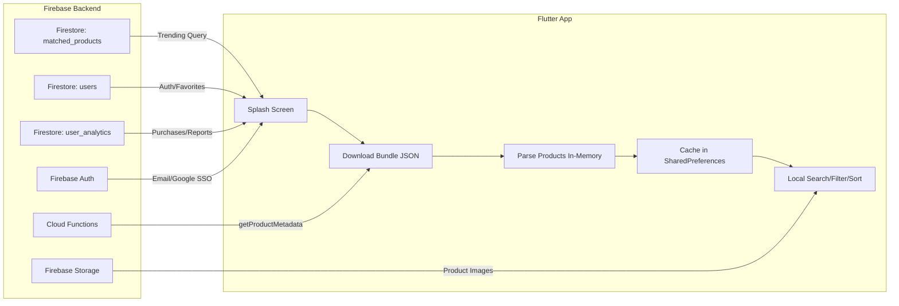
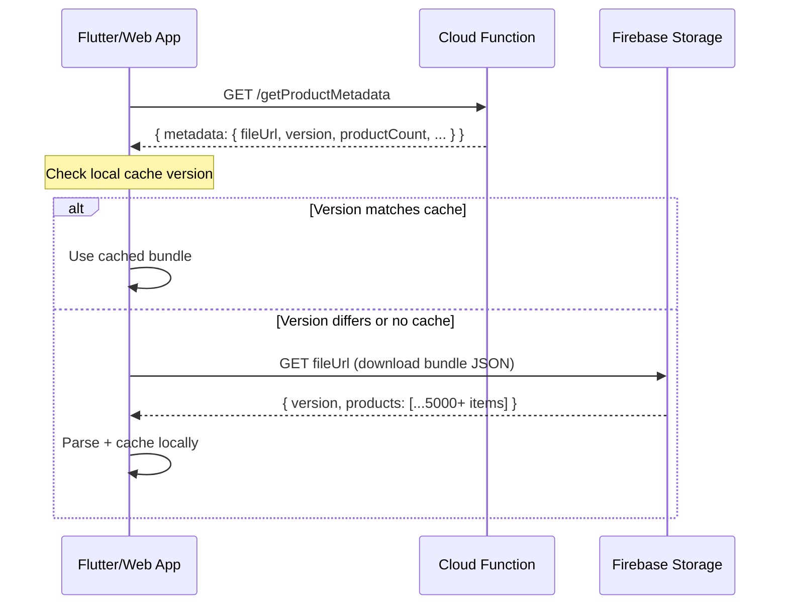

# Qeemat Backend Migration Document
## Flutter Firebase Backend → Python Backend for React Web App

---

## 1. Current Architecture Overview

### How It Works Today



The current system has **no traditional backend server**. The Flutter app talks directly to Firebase services:

| Component | Current Implementation | What It Does |
|-----------|----------------------|--------------|
| **Product Data** | Cloud Function → JSON bundle file → local parse | All ~5000+ products downloaded as a single JSON file at startup |
| **Search** | Client-side in-memory filtering | No server-side search at all |
| **Auth** | Firebase Auth (Email + Google) | User sessions managed by Firebase SDK |
| **User Data** | Firestore `users` collection | Username, display name, profile |
| **Favorites** | Firestore `users/{uid}/favorites` subcollection | Toggle + real-time sync |
| **Analytics** | Firestore `user_analytics` collection | Purchase tracking, price reports, product stats |
| **Trending** | Firestore query (`matched_products_count > 2`) | Daily-cached trending products |
| **Images** | Firebase Storage (`gs://` URLs) | Product images served via Storage |
| **Notifications** | WorkManager + flutter_local_notifications | Local push notifications (mobile only) |
| **Ads** | Google AdMob | Banner + interstitial + native ads (mobile only) |

### React Frontend Current State

The React frontend at `/Users/rowdy/Projects/qemat_web_app/` currently uses **hardcoded mock data** — no real Firebase integration:
- `app-store.tsx` — Context provider with mock auth (localStorage), mock favorites
- `mock-data.ts` — 18 hardcoded products, 6 stores, 17 categories
- Auth is fake (`crypto.randomUUID()` for user IDs)
- No bundle download, no Firestore, no Cloud Functions

---

## 2. Data Models (Source of Truth)

### 2.1 Product Model

**Firestore Collection**: `matched_products`

| Field | Type | Description |
|-------|------|-------------|
| `document_id` | string | Firestore doc ID |
| `product_id` | string | Unique slug (e.g. `ALFATAH_milk_1kg`) |
| `name` / `product_name` | string | Display name (`product_name` for pharma) |
| `price` | number | Price in PKR |
| `store_id` | string | Store name: `Al-Fatah`, `Carrefour`, `Imtiaz`, `Jalal Sons`, `Metro`, `Rainbow` |
| `category` | string | Category name |
| `categoryNameVariations` | string[] | Search aliases (English, Urdu, Roman Urdu) |
| `image_url` | string | Firebase Storage URL (`gs://` or `https://`) |
| `original_url` | string | Source scraping URL |
| `matched_products` | string[] | Product IDs of same product at other stores |
| `matched_products_count` | number | Count of matches |
| `is_verified` | boolean | Price verification status |
| `created_at` | Timestamp | Creation date |
| `last_updated` | Timestamp | Last update date |

> [!IMPORTANT]
> The `name` field is `product_name` for pharmaceuticals and `name` for groceries. The Python backend must handle both.

### 2.2 User Model

**Firestore Collection**: `users` (doc ID = Firebase Auth UID)

| Field | Type | Description |
|-------|------|-------------|
| `email` | string | User email |
| `username` | string | Unique username (set after signup) |
| `displayName` | string | Display name |
| `photoURL` | string | Profile photo URL |
| `createdAt` | Timestamp | Account creation |
| `updatedAt` | Timestamp | Last profile update |
| `lastSignInTime` | Timestamp | Last login |

**Subcollection**: `users/{uid}/favorites` (doc ID = productId)

| Field | Type | Description |
|-------|------|-------------|
| `productId` | string | Product ID |
| `addedAt` | Timestamp | When favorited |

### 2.3 Analytics Models

**Collection**: `user_analytics/product_purchases/{productId}/{docId}`

| Field | Type |
|-------|------|
| `productId` | string |
| `userId` | string (nullable) |
| `userEmail` | string (nullable) |
| `sessionId` | string |
| `isGuestUser` | boolean |
| `timestamp` | Timestamp |
| `source` | string |

**Collection**: `user_analytics/product_reports/{productId}/{docId}`

Same as purchases, plus: `reason` (`price_higher`, `price_lower`, `general_price_issue`), `status` (`pending`, `reviewed`, `resolved`)

**Collection**: `user_analytics/product_stats/stats/{productId}`

| Field | Type |
|-------|------|
| `total_purchases` / `total_reports` | number |
| `guest_purchases` / `guest_reports` | number |
| `registered_purchases` / `registered_reports` | number |
| `last_purchase` / `last_report` | Timestamp |

---

## 3. Bundle System (Critical Data Pipeline)

This is the most important system to understand. The app does **NOT** query Firestore for individual products — it downloads everything at once.

### 3.1 How It Works



### 3.2 Cloud Function Endpoints

| Endpoint | URL | Response |
|----------|-----|----------|
| Product Metadata | `GET https://asia-south1-qemat-a2a2c.cloudfunctions.net/getProductMetadata` | `{ metadata: { fileUrl, version, productCount, lastUpdated, exportDate } }` |
| Pharma Metadata | `GET https://asia-south1-qemat-a2a2c.cloudfunctions.net/getPharmaceuticalsMetadata` | Same structure |

### 3.3 Bundle JSON Structure

```json
{
  "version": "v1.2.3",
  "productCount": 5000,
  "lastUpdated": "2026-03-01T00:00:00Z",
  "exportDate": "2026-03-01T00:00:00Z",
  "products": [
    {
      "document_id": "abc123",
      "product_id": "ALFATAH_milk_1kg",
      "name": "Olpers Milk 1L",
      "price": 320,
      "store_id": "Al-Fatah",
      "category": "Milk",
      "categoryNameVariations": ["Milk", "Doodh", "دودھ"],
      "image_url": "gs://qemat-a2a2c.appspot.com/...",
      "original_url": "https://...",
      "matched_products": ["IMTIAZ_milk_1kg", "METRO_milk_1kg"],
      "matched_products_count": 2,
      "is_verified": true,
      "created_at": "2026-01-15T10:00:00Z",
      "last_updated": "2026-03-01T00:00:00Z"
    }
  ]
}
```

### 3.4 Caching Strategy (Flutter → Web Equivalent)

| Flutter | Web Equivalent | Python Backend Role |
|---------|---------------|-------------------|
| `SharedPreferences` bundle version | `localStorage` / `IndexedDB` | Serve version endpoint |
| `SharedPreferences` bundle data | `localStorage` / `IndexedDB` | Serve bundle data |
| In-memory `_cachedProducts` List | React state / Zustand store | Serve products via API |
| 1-hour cache validity | Same | ETags / cache headers |

---

## 4. Service-by-Service Migration Map

### 4.1 Authentication Service

**Source**: [auth_service.dart](file:///Users/rowdy/Projects/qeemat/lib/services/auth_service.dart)

| Flutter Method | Python API Endpoint | Notes |
|---------------|-------------------|-------|
| `signInWithEmailAndPassword()` | `POST /api/auth/login` | Firebase Admin SDK verify token |
| `signUpWithEmailAndPassword()` | `POST /api/auth/register` | Create user in Firestore + Firebase Auth |
| `signInWithGoogle()` | `POST /api/auth/google` | Verify Google ID token |
| `signOut()` | `POST /api/auth/logout` | Invalidate session |
| `isUsernameAvailable()` | `GET /api/auth/username/check?username=x` | Firestore query |
| `updateUsername()` | `PUT /api/auth/username` | Update Firestore + cache |
| `hasUserSetUsername()` | `GET /api/auth/me` | Return user profile |
| `getUserDisplayName()` | `GET /api/auth/me` | Part of user profile |

> [!NOTE]
> **Two approaches for web auth:**
> 1. **Firebase Auth on clientside** (recommended for now) — React uses Firebase SDK directly, backend verifies ID tokens via Firebase Admin SDK
> 2. **Full server auth** — Backend manages all auth (more complex migration)

### 4.2 Product Service

**Source**: [product_service.dart](file:///Users/rowdy/Projects/qeemat/lib/services/product_service.dart) (1158 lines)

| Flutter Method | Python API Endpoint | Notes |
|---------------|-------------------|-------|
| `fetchBundleMetadata()` | `GET /api/products/metadata` | Proxy to Firebase Cloud Function (or serve directly) |
| `downloadBundleForSplash()` | `GET /api/products/bundle` | Serve bundle JSON (cache on server side too) |
| `preloadData()` | N/A (client calls bundle) | |
| `searchProducts(query)` | `GET /api/products/search?q=x` | Server-side search (much better than client-side) |
| `getProducts()` | `GET /api/products` | Paginated product list |
| `getProductsByCategory(cat)` | `GET /api/products?category=x` | Filter parameter |
| `getProductsByStore(store)` | `GET /api/products?store=x` | Filter parameter |
| `getProduct(id)` | `GET /api/products/{id}` | Single product |
| `getProductWithMatches(id)` | `GET /api/products/{id}/matches` | Product + matched products |
| `preloadTrendingProducts()` | `GET /api/products/trending` | Server-side query |
| `searchPharmaceuticals(q)` | `GET /api/products/search?q=x&type=pharma` | Type filter |

### 4.3 Favorites Service

**Source**: Part of [product_service.dart](file:///Users/rowdy/Projects/qeemat/lib/services/product_service.dart)

| Flutter Method | Python API Endpoint |
|---------------|-------------------|
| `toggleFavorite(productId, userId)` | `POST /api/favorites/{productId}` |
| `loadUserFavorites(userId)` | `GET /api/favorites` |
| `getFavoriteProducts(userId)` | `GET /api/favorites/products` |
| `clearAllFavorites(userId)` | `DELETE /api/favorites` |
| `isFavorite(productId)` | Part of `GET /api/favorites` |

### 4.4 Analytics Service

**Source**: [analytics_service.dart](file:///Users/rowdy/Projects/qeemat/lib/services/analytics_service.dart)

| Flutter Method | Python API Endpoint |
|---------------|-------------------|
| `trackPurchase(productId)` | `POST /api/analytics/purchase` |
| `trackPriceReport(productId, reason)` | `POST /api/analytics/report` |
| `trackUserAction(action, data)` | `POST /api/analytics/action` |

### 4.5 Services NOT Needed in Web Backend

| Service | Why Skip |
|---------|----------|
| `NotificationService` | Mobile-only (WorkManager / local notifications) |
| `AdService` | Mobile-only (AdMob) |
| `LazyInitializationService` | Mobile lifecycle management |
| `BackgroundWorker` | Mobile background tasks |
| `PerformanceMonitor` | Flutter-specific profiling |

---

## 5. Recommended Python Backend Stack

### 5.1 Technology Choices

| Component | Recommendation | Why |
|-----------|---------------|-----|
| **Framework** | **FastAPI** | Async, auto-docs (OpenAPI/Swagger), type-safe with Pydantic |
| **Firebase Admin** | `firebase-admin` | Auth token verification, Firestore access |
| **Database** | **Firebase Firestore** (keep existing) | No migration needed — same data source |
| **Caching** | **Redis** or in-memory | Cache bundle data, trending products |
| **Image proxy** | Firebase Storage SDK | Convert `gs://` URLs to signed HTTPS URLs |
| **Deployment** | Cloud Run / Railway / Fly.io | Easy containerized deployment |

### 5.2 Project Structure

```
qeemat_backend/
├── app/
│   ├── __init__.py
│   ├── main.py                  # FastAPI app entry point
│   ├── config.py                # Firebase config, env vars
│   ├── dependencies.py          # Auth dependency injection
│   │
│   ├── models/
│   │   ├── product.py           # Product Pydantic models
│   │   ├── user.py              # User models
│   │   └── analytics.py         # Analytics models
│   │
│   ├── routers/
│   │   ├── auth.py              # /api/auth/* routes
│   │   ├── products.py          # /api/products/* routes
│   │   ├── favorites.py         # /api/favorites/* routes
│   │   └── analytics.py         # /api/analytics/* routes
│   │
│   ├── services/
│   │   ├── firebase_service.py  # Firestore + Storage client
│   │   ├── product_service.py   # Bundle fetching, search, caching
│   │   ├── auth_service.py      # Token verification, user management
│   │   ├── analytics_service.py # Purchase/report tracking
│   │   └── cache_service.py     # In-memory / Redis caching
│   │
│   └── middleware/
│       ├── auth.py              # JWT/Firebase token middleware
│       └── cors.py              # CORS configuration
│
├── requirements.txt
├── Dockerfile
├── .env.example
└── README.md
```

---

## 6. API Specification

### 6.1 Authentication

```
POST /api/auth/register
  Body: { email, password }
  Response: { user: {...}, token: string }

POST /api/auth/login
  Body: { email, password }
  Response: { user: {...}, token: string }

POST /api/auth/google
  Body: { idToken: string }
  Response: { user: {...}, token: string }

POST /api/auth/logout
  Headers: Authorization: Bearer <token>
  Response: { success: true }

GET /api/auth/me
  Headers: Authorization: Bearer <token>
  Response: { uid, email, username, displayName, photoURL }

GET /api/auth/username/check?username=x
  Response: { available: boolean }

PUT /api/auth/username
  Headers: Authorization: Bearer <token>
  Body: { username, displayName }
  Response: { success: true }
```

### 6.2 Products

```
GET /api/products/metadata
  Response: { fileUrl, version, productCount, lastUpdated, exportDate }

GET /api/products/metadata/pharma
  Response: same structure

GET /api/products/bundle
  Query: ?type=grocery|pharma
  Response: Full bundle JSON (cached, with ETag)

GET /api/products
  Query: ?category=x&store=x&page=1&limit=20&type=grocery|pharma
  Response: { products: [...], total, page, pages }

GET /api/products/search
  Query: ?q=milk&type=grocery|pharma&store=x&page=1&limit=20
  Response: { products: [...], total }

GET /api/products/trending
  Response: { products: [...] }  (4–6 products, daily cached)

GET /api/products/{productId}
  Response: { product: {...} }

GET /api/products/{productId}/matches
  Response: { product: {...}, matches: [...] }
```

### 6.3 Favorites

```
GET /api/favorites
  Headers: Authorization: Bearer <token>
  Response: { favoriteIds: string[] }

GET /api/favorites/products
  Headers: Authorization: Bearer <token>
  Response: { products: [...] }

POST /api/favorites/{productId}
  Headers: Authorization: Bearer <token>
  Response: { added: boolean }  (toggle)

DELETE /api/favorites
  Headers: Authorization: Bearer <token>
  Response: { cleared: number }
```

### 6.4 Analytics

```
POST /api/analytics/purchase
  Headers: Authorization: Bearer <token> (optional — guest allowed)
  Body: { productId, source? }
  Response: { success: true }

POST /api/analytics/report
  Headers: Authorization: Bearer <token> (optional)
  Body: { productId, reason: "price_higher"|"price_lower"|"general_price_issue" }
  Response: { success: true }

POST /api/analytics/action
  Headers: Authorization: Bearer <token> (optional)
  Body: { action, data? }
  Response: { success: true }
```

---

## 7. Key Implementation Notes

### 7.1 Bundle System Strategy

> [!IMPORTANT]
> **Decision needed**: Keep the bundle-download approach or switch to paginated API?

| Approach | Pros | Cons |
|----------|------|------|
| **Keep Bundle** (proxy Cloud Function) | Zero migration risk, same behavior as Flutter | Large payload (~2–5MB), slow first load |
| **Paginated API** (new) | Better web performance, server-side search | Requires significant frontend rewrite |
| **Hybrid** (recommended) | Bundle for initial load + API for search/filter | Best of both worlds |

**Recommended hybrid approach:**
1. Serve pre-built bundle via `GET /api/products/bundle` (cached on server + CDN)
2. Add `GET /api/products/search` for real server-side search
3. Frontend loads bundle on startup (like Flutter), but uses search API for queries

### 7.2 Image URL Handling

Firebase Storage `gs://` URLs must be converted to HTTPS download URLs. The Python backend should:

```python
from firebase_admin import storage

def get_download_url(gs_url: str) -> str:
    if gs_url.startswith("gs://"):
        bucket_name = gs_url.split("/")[2]
        blob_path = "/".join(gs_url.split("/")[3:])
        bucket = storage.bucket(bucket_name)
        blob = bucket.blob(blob_path)
        return blob.generate_signed_url(expiration=timedelta(hours=24))
    return gs_url  # Already HTTPS
```

### 7.3 Search Logic

The Flutter app searches by **name** and **categoryNameVariations** (includes Urdu and Roman Urdu):

```python
def search_products(products: list, query: str) -> list:
    q = query.lower().strip()
    return [
        p for p in products
        if q in p["name"].lower()
        or any(q in v.lower() for v in p.get("categoryNameVariations", []))
    ]
```

### 7.4 Analytics Batch Writes

The Flutter app uses Firestore batch writes for atomicity. Python equivalent:

```python
from firebase_admin import firestore

db = firestore.client()
batch = db.batch()

purchase_ref = db.collection("user_analytics").document("product_purchases") \
    .collection(product_id).document(doc_id)
batch.set(purchase_ref, purchase_data)

stats_ref = db.collection("user_analytics").document("product_stats") \
    .collection("stats").document(product_id)
batch.set(stats_ref, stats_data, merge=True)

batch.commit()
```

### 7.5 Guest User Support

Analytics endpoints must support **both authenticated and guest users**:
- Guest session ID format: `guest_{timestamp}_{random_4_digits}`
- `userId` and `userEmail` are `null` for guests
- `isGuestUser: true` flag is set

### 7.6 Category Reference (for search/filtering)

| Category | Urdu | Roman Urdu |
|----------|------|------------|
| Milk | دودھ | Doodh |
| Cooking Oil | گھی اور تیل | Ghee aur Tel |
| Rice | چاول | Chawal |
| Tea | چائے | Chai |
| Flour | آٹا | Aata |
| Sugar | چینی | Cheeni |
| Beverages | مشروبات | Mashroobat |
| Snacks | ہلکے پھلکے کھانے | Halke Phulke Khane |
| Frozen | فروزن | Frozen |

### 7.7 Store IDs

```python
VALID_STORES = ["Al-Fatah", "Carrefour", "Imtiaz", "Jalal Sons", "Metro", "Rainbow"]
```

---

## 8. Migration Phases

### Phase 1: Foundation (Week 1)
- [ ] Set up FastAPI project structure
- [ ] Configure Firebase Admin SDK (service account)
- [ ] Implement CORS middleware
- [ ] Create Pydantic models for Product, User, Analytics
- [ ] Set up health check endpoint

### Phase 2: Products & Bundle (Week 1–2)
- [ ] `GET /api/products/metadata` — proxy Cloud Function
- [ ] `GET /api/products/bundle` — download + cache + serve bundle
- [ ] `GET /api/products/{id}` — single product lookup
- [ ] `GET /api/products/{id}/matches` — product with matched items
- [ ] `GET /api/products/trending` — daily-cached trending
- [ ] `GET /api/products/search` — server-side search
- [ ] Image URL resolution (gs:// → HTTPS)
- [ ] Server-side caching (Redis or in-memory)

### Phase 3: Authentication (Week 2)
- [ ] Firebase token verification middleware
- [ ] `POST /api/auth/register` / `login` / `google`
- [ ] `GET /api/auth/me`
- [ ] `GET /api/auth/username/check`
- [ ] `PUT /api/auth/username`
- [ ] `POST /api/auth/logout`

### Phase 4: Favorites & Analytics (Week 2–3)
- [ ] `POST /api/favorites/{productId}` (toggle)
- [ ] `GET /api/favorites` / `GET /api/favorites/products`
- [ ] `DELETE /api/favorites`
- [ ] `POST /api/analytics/purchase`
- [ ] `POST /api/analytics/report`
- [ ] `POST /api/analytics/action`
- [ ] Batch writes for analytics atomicity

### Phase 5: React Integration (Week 3)
- [ ] Replace mock data in `app-store.tsx` with real API calls
- [ ] Wire up Firebase Auth (client-side SDK)
- [ ] Connect product pages to `GET /api/products/bundle`
- [ ] Connect search to `GET /api/products/search`
- [ ] Connect favorites/analytics
- [ ] Add proper loading/error states

---

## 9. Environment Configuration

```env
# .env
FIREBASE_PROJECT_ID=qemat-a2a2c
FIREBASE_SERVICE_ACCOUNT_PATH=./service-account.json
FIREBASE_STORAGE_BUCKET=qemat-a2a2c.firebasestorage.app

# Cloud Function URLs (existing)
PRODUCT_METADATA_URL=https://asia-south1-qemat-a2a2c.cloudfunctions.net/getProductMetadata
PHARMA_METADATA_URL=https://asia-south1-qemat-a2a2c.cloudfunctions.net/getPharmaceuticalsMetadata

# Server
HOST=0.0.0.0
PORT=8000
CORS_ORIGINS=http://localhost:3000,https://qemat.com

# Caching
BUNDLE_CACHE_TTL_SECONDS=3600
TRENDING_CACHE_TTL_SECONDS=86400
```

---

## 10. Files Studied

| File | Lines | Key Insights |
|------|-------|--------------|
| [BACKEND_API_DOCUMENTATION.md](file:///Users/rowdy/Projects/qeemat/BACKEND_API_DOCUMENTATION.md) | 997 | Complete Firebase reference |
| [product_service.dart](file:///Users/rowdy/Projects/qeemat/lib/services/product_service.dart) | 1158 | Bundle system, search, favorites, trending, pharma |
| [auth_service.dart](file:///Users/rowdy/Projects/qeemat/lib/services/auth_service.dart) | 220 | Email/Google auth, username mgmt |
| [analytics_service.dart](file:///Users/rowdy/Projects/qeemat/lib/services/analytics_service.dart) | 177 | Purchase/report tracking with batch writes |
| [notification_service.dart](file:///Users/rowdy/Projects/qeemat/lib/services/notification_service.dart) | 426 | Mobile-only (not migrated) |
| [product.dart](file:///Users/rowdy/Projects/qeemat/lib/models/product.dart) | 265 | Product model with 4 serialization methods |
| [splash_screen.dart](file:///Users/rowdy/Projects/qeemat/lib/screens/splash_screen.dart) | 718 | Split download/parse strategy |
| [main.dart](file:///Users/rowdy/Projects/qeemat/lib/main.dart) | 127 | Firebase init, Firestore settings |
| [app-store.tsx](file:///Users/rowdy/Projects/qemat_web_app/src/store/app-store.tsx) | 129 | React frontend — currently mock data |
| [mock-data.ts](file:///Users/rowdy/Projects/qemat_web_app/src/lib/mock-data.ts) | 299 | 18 mock products, 6 stores |
